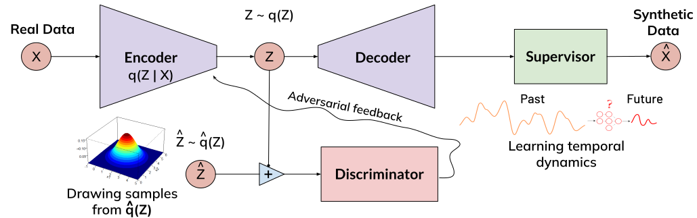

# AVATAR: Adversarial Autoencoders with Autoregressive Refinement for Time Series Generation

## Abstract

Data augmentation can significantly enhance the performance of machine learning tasks by addressing data scarcity and improving generalization. However, generating realistic time series data presents unique challenges. A model must not only learn a probability distribution that reflects the real data distribution but also capture the conditional distribution at each time step to preserve the inherent temporal dependencies in time series data. To address these challenges, we introduce AVATAR, a framework that combines Adversarial Autoencoders (AAE) with Autoregressive Learning to achieve both objectives. Specifically, our technique integrates the autoencoder with a supervisor and introduces a novel supervised loss to assist the decoder in learning the temporal dynamics of time series data. Additionally, we propose an innovative loss function, termed distribution loss, to guide the encoder in more efficiently aligning the aggregated posterior of the autoencoder’s latent representation with a prior Gaussian distribution. Furthermore, our framework employs a joint training mechanism to simultaneously train all networks using a combined loss, thereby fulfilling the dual objectives of time series generation. We evaluate our technique against leading methods, including TimeGAN, across a variety of time series datasets with diverse characteristics. Our experiments demonstrate significant improvements in both the quality and practical utility of the generated data, as assessed by various qualitative and quantitative metrics. 




## Installation
Clone the repository and install dependencies:
```bash
git clone https://github.com/samresume/AVATAR.git
cd AVATAR
pip install -r requirements.txt
```

## Usage
To get started, run the tutorial notebook:
```bash
jupyter notebook tutorial.ipynb
```

## Files
- `avatar.py`: Main implementation of the AVATAR model.
- `data_loading.py`: Functions for loading and preprocessing data.
- `utils.py`: Helper utilities for the model.


